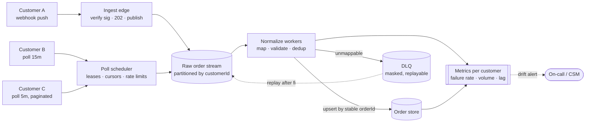

# DESIGN — order ingestion at scale

The service in this repo is deliberately small. This is how it becomes production for
hundreds of customers across mixed push/pull modes and cadences from sub-second to
nightly.

**Thesis:** *ingestion is decoupled from processing; everything customer-specific is
config; identity is a stable key.* Every section names the seed already in the code and
what it grows into — scale claims not anchored in something real are just vocabulary.

> **If I could build only one thing here, it would be §6 — contract-drift detection.**
> At three customers, a broken integration is a support ticket. At three hundred, a
> customer silently renaming a status field is a slow leak nobody notices until a month
> of their orders is missing.

## 1. Architecture at scale

**Today:** the webhook controller and both pollers hand raw records to one
`IngestionPipelineService` — normalize → validate → dedup → persist — and neither entry
point knows anything about a customer.

**At scale:** that seam becomes the queue boundary. Arrival (accept, publish raw) splits
from processing (normalize, persist), and the pipeline becomes a consumer group — they
have completely different load shapes (A is bursty and latency-sensitive, C a steady
trickle, a nightly-CSV customer one 2 a.m. spike) and must scale on separate axes.

The trade-off bought: an extra hop and eventual consistency — an order is *accepted*
before it is *queryable* — in exchange for absorbing bursts and reprocessing history. For
order fulfilment that's the right side of the trade, but the bill is real: "why isn't my
order in your UI yet" becomes a question we have to answer.

## 2. Polling at scale

**Today:** `PollingService` schedules one interval per pull customer from config;
`SourceReaderService` walks pages, honours a per-customer `RateLimiter`, and backs off on
429. `maxPagesPerCycle` bounds a runaway feed; an `inFlight` guard stops a slow customer
stacking cycles on itself.

**At scale:** a scheduler hands *poll jobs* to a worker pool instead of every replica
owning a `setInterval`. Per-customer intervals stay config — they already are.

The real upgrade is **client-side cursors/watermarks**. Both feeds return sliding,
overlapping windows with no `since` param, so today we re-read every cycle and let the
idempotent upsert absorb it. That wastes requests at volume, and it makes us *depend on
someone else's cursor*: Customer C's `page=1` is a side effect that advances **their**
window, and their `429` happens to come back before that advance. I verified both against
the live mock (`pnpm test:e2e`) rather than assume them — but a behaviour I verified is
not a behaviour they promised. Holding the cursor our side makes re-reading
non-destructive by construction rather than by their goodwill. Where a source has no
cursor at all (a nightly file), we keep a watermark of the last-seen key set.

## 3. Webhook ingestion

**Today:** `POST /webhooks/:customer` answers `202` when at least one record was ingested
and `400` when none were — the status is honest about what we took responsibility for.
Processing is inline, because at this size it is.

**At scale:** the 202 becomes a *real* ack-and-enqueue — verify signature, write raw to
the stream, return; nothing else on the request path. Our normalizer being slow can then
never turn into their webhook timing out and retrying, which is how a burst becomes a
stampede. Signature verification (HMAC over the raw body, per-customer secret, timestamp
replay window) belongs at that edge, before anything is queued.

Retries are *their* retries: because dedup is by stable key (§4), re-delivery is free, so
we can tell customers to retry aggressively.

## 4. Exactly-once & idempotency

**Today:** `orderId = sha256(customerId + ':' + externalOrderId)`. The write is an
**upsert, not "insert, ignoring duplicates"** — a polled order we've seen before may come
back with a *new status*, and dropping it as a duplicate would silently discard that
update. The same key collapses an order repeated *inside* one batch (both feeds do this)
and one re-read *across* cycles.

**At scale:** transport is at-least-once — that's what SQS and Kafka give you, and chasing
true exactly-once delivery is where architectures go to die. Instead: **at-least-once
delivery + dedup on a stable key = exactly-once *effect*.** The key is derived from data
the customer already owns, so it survives retries, replays and a worker dying mid-batch.

The honest gap: last-write-wins is only correct because **no customer sends a version or
`updatedAt`** — there is nothing to compare against. With a source that exposes one, the
write becomes conditional (`WHERE version < :incoming`), which is what survives the
out-of-order delivery a partitioned queue with retries eventually hands you.

## 5. Backpressure & isolation

**Today:** a source being down throws out of the reader and is caught per poll cycle, so
GlobalGoods being unreachable cannot stop BairroBox being ingested. Polling is a
*singleton* concern: `POLLING_ENABLED=false` exists so N replicas don't mean N pollers
spending N times a customer's rate limit on work the upsert then discards.

**At scale:** that flag becomes a **scheduler with leases** — one replica holds a
customer's poll job and it fails over. Isolation becomes structural: the raw stream is
**partitioned by `customerId`**, so a customer sending malformed records at 10× volume
fills *their* partition and starves nobody else. One noisy neighbour becoming everyone's
outage is how a platform incident turns into a churn event.

Two bounds needed first: `/orders` must be paginated (it returns everything today), and
batch sizes need a ceiling on the way into the queue.

## 6. Failure handling & observability — the one that matters

**Today:** a bad record never crashes a batch. It becomes a **failure with a reason** —
customer, order, **field**, message — and `/stats` carries per-customer counters
(received / normalized / created / duplicated / failed). Reasons **never echo PII**: they
name the field and the problem, never the customer's address.

**Retries and a DLQ.** Transient failures retry with backoff; an unmappable record
dead-letters *with its reason* and is replayable once the mapper is fixed. Replay is safe
because of §4 — a replayed order lands on the row it already owns — and *legal* because of
the PII rule: you replay masked records, not customer addresses.

**Contract-drift detection.** Nobody tells you they changed their API; they change it, and
your failure rate moves. So alert on **per-customer mapping-failure rate** crossing a
threshold, on **volume anomaly** (BairroBox averages 40 orders/hour and just sent 0 —
holiday, or broken export?), and on **silence**: a customer whose nightly file never
arrived looks identical to one with no orders, and only a freshness check tells them
apart. That is the difference between *they call us angry* and *we call them first* —
which, for a Solutions Engineer, is the job. `/stats` is this in miniature: here a
counter, in production a metric with a threshold.

**Security posture.** `/stats` and `/orders` expose customer data and need auth and
per-tenant authorisation; reasons stay masked; DLQ payloads get a retention window.

## 7. Trade-offs — what I kept small on purpose

The brief says the design assessment is a document, *not more code*, and says not to spend
the budget on infra. So:

- **In-memory store behind an `OrderRepository` interface.** The stable `orderId` *is* the
  map key, so idempotency is the data structure rather than a layer on top. Swapping in
  SQLite or Postgres is one `useClass`.
- **Synchronous pipeline, no queue.** Building Kafka into a take-home would over-deliver
  past the brief and under-deliver on the thinking. The seam is there; the broker is not.
- **No auth, no signature verification.** Required at the edge, named above, not built.

Deferred, and wanted before real traffic: **minor units are hardcoded ×100** — right for
BRL and MXN, wrong for JPY (0 decimals) and KWD (3), so it needs a per-currency exponent
table I chose not to build for two currencies — plus real cursors, per-customer
partitions, `/orders` pagination and batch bounds.

The core is deliberately small and correct. The scale story is decisions — not code I
didn't need yet.
